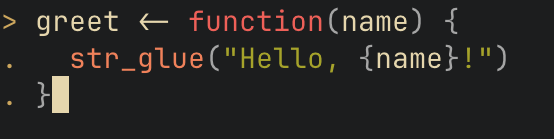
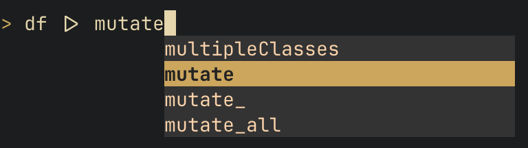
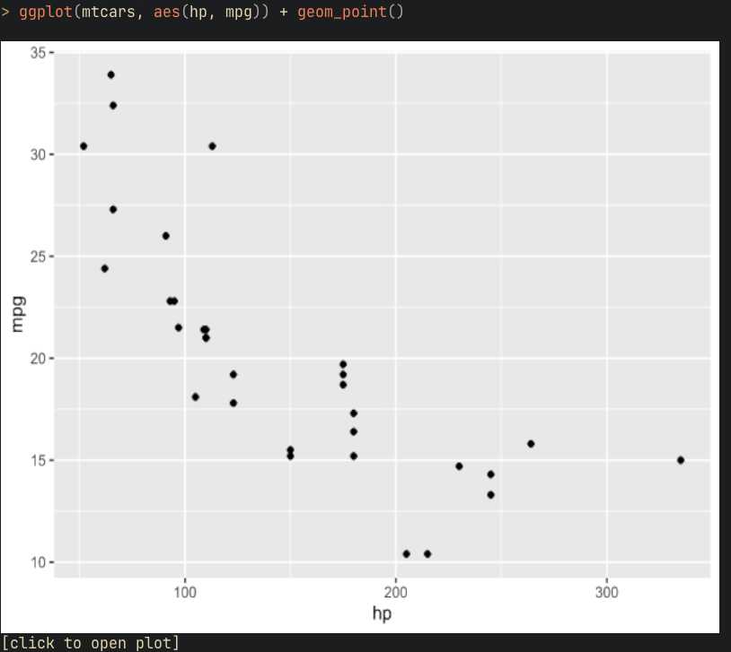

# Raoui: a modern R console for busy statisticians

_Warning: This is pre-alpha software. It might not run on your computer. Expect some bugs._

### Why build Raoui?

R in the terminal is great for quick analysis, portability, and working on remote servers. The R extension in VS Code also uses the terminal for interactive features. However, the console that ships with the R programming language is bare-bones and lacks quality of life features like syntax highlighting and tab autocomplete. A fantastic alternative is radian, which uses the prompttoolkit python library to add these features to terminal R. However, it can be laggy and I want to add even more features on top of what radian provides. This repo aims to provide a smooth experience of terminal R without sacrificing feature-richness, and serves as a foundation for me to experiment with adding more features to the experience of working with the language.

### Features:

- Syntax highlighting



- Tab autocomplete



- Inline graphs in the terminal using Kitty or ITerm



- Fast performance and startup
- Multi-line editing
- Smooth integration with the VS Code extension
- Full unicode support
- Type your next command while the current command is finishing
- Shell mode to enter bash commands directly
- Magic commands like in IPython (use these to load a file with the Finder app, or insert unicode math symbols)

### Architecture

Unlike traditional REPLs, I run the UI and interpreter on separate OS threads. This is similar to how interactive data analysis works in Jupyter Notebooks. The interpreter thread uses C to link against the R language at runtime, and communicates asynchronously with the UI via a ring buffer. This allows the UI to start up very fast without waiting for R to initialize, and to not block while code is executing, which avoids some visual jank when typing characters while code executes in other environments, and could allow for more fancy features later. The UI thread is built as an event-driven runtime using the Elm architecture. Dependencies are fairly minimal, allowing for fine-grained control over performance and a small binary.

### Build instructions

You will need OCaml 5.0+ and a C compiler. Build with

```bash
opam install --deps-only .
dune exec raoui
```

### AI usage

While I designed the architecture and wrote some modules by hand, I used LLMs extensively to accelerate implementation. My process is to spend significant time designing features and planning their implementation, then let AI write much of the initial code, which I review, test, and refine. I maintain a close understanding of the full codebase.
